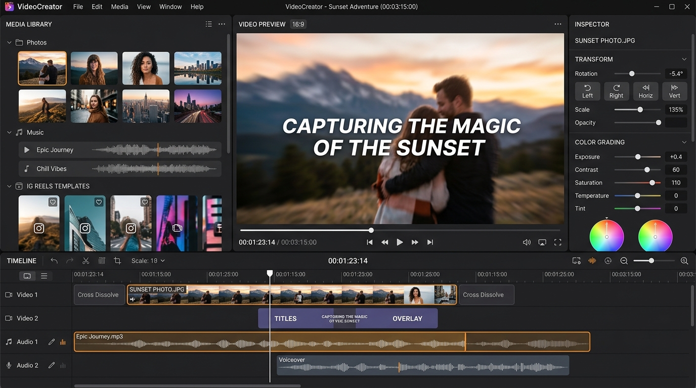

# VideoCreator 🎬

> **A rich, modern, cross-platform video creation and editing studio available for both Desktop (.NET 8 / Avalonia / FFmpeg) and Web (HTML5 Canvas / Web Audio / GitHub Pages).**

### 👨‍💻 Created by: **Shatrughna Ambhore**
* 📧 **Email**: [ambhoreshatrughna@gmail.com](mailto:ambhoreshatrughna@gmail.com)
* 📞 **Phone / WhatsApp**: `+91 9604466334`
* 🌐 **Live Web Studio**: [https://shatru123.github.io/VideoCreator/](https://shatru123.github.io/VideoCreator/)
* 🐙 **GitHub Repository**: [https://github.com/shatru123/VideoCreator](https://github.com/shatru123/VideoCreator)

---



Turn your photos and music into cinematic videos in seconds with automatic beat-sync timing, smooth Ken Burns camera motion, transition shaders, and professional text overlays, while retaining a full non-destructive multi-track studio editor.

---

## 🌐 Live Web Studio (Free Hosting)

* **Live URL**: [https://shatru123.github.io/VideoCreator/](https://shatru123.github.io/VideoCreator/)
* **100% Client-Side Privacy**: Runs completely inside your browser with zero server uploads and instant MP4/WebM video export.

---

## ✨ Features

- **⚡ Quick Create Wizard**: 4-step beginner experience to upload photos, choose music, pick a style template, and generate a video automatically.
- **🎞 Multi-Track Studio Editor**: Non-destructive video tracks, overlay/text tracks, and audio tracks with split, trim, resize, and reorder.
- **🔄 Image Transformations & Rotation**:
  - **90° Step Rotation** (`↺ -90°` / `↻ +90°`) & **Continuous Free-Angle Slider** ($-180^\circ$ to $+180^\circ$).
  - **Horizontal & Vertical Flip** (`⇄ Flip H`, `⇅ Flip V`).
  - **Scale / Zoom Slider** ($0.5\times$ to $2.5\times$) & **Pan Position Offset**.
  - **Dynamic State Clarity**: Smart `+ Insert` $\leftrightarrow$ `− Remove` toggle with `✓ In Video` status badge.
- **📸 Ken Burns Photo Motion**: Dynamic camera presets including *Zoom In, Zoom Out, Pan Left, Pan Right, Pan Up, Pan Down, Diagonal, and Cinematic*.
- **🖼 Smart Crop & Blurred Background**: Elegant handling of portrait/landscape aspect ratio mismatches with Gaussian-blurred backgrounds.
- **🔤 Animated Text Overlays**: 14+ font families (`Inter`, `Impact`, `Playfair Display`, `Cinzel`, `Georgia`, `Courier New`, `Arial`, etc.), background pills, drop shadows, stroke outlines, and entry/exit animations (*Fade, Slide, Pop, Zoom, Typewriter*).
- **🎨 Non-Destructive Effects & Tone Grading**: Real-time color filters (*Brightness, Contrast, Grayscale, Vintage Sepia, Cinematic Teal/Orange, Vignette, Blur, Glow*).
- **🔄 Transition Shaders**: *Cross Dissolve, Slide Left/Right/Up/Down, Push, Zoom Blur, Wipe, and Fade*.
- **🎵 Audio Analysis & Real-Time Playback**: Beat detection, RMS waveform rendering, real-time synchronized playback in editor, volume control, and audio fade-in/fade-out.
- **📐 Multi-Aspect Canvas**: 16:9 Landscape (YouTube), 9:16 Vertical (Instagram Reels / TikTok / Shorts), 1:1 Square, and 4:5 Portrait.
- **🚀 100% Universal Player MP4 Export**: 1080p Full HD & 4K encoded with `H.264 High Profile Level 4.1`, `-movflags +faststart`, Apple BT.709 color tags, and Stereo AAC audio for guaranteed playback on **QuickTime Player, Windows Media Player, VLC, Safari, iPhone, Android, Instagram, and YouTube**.
- **💾 Autosave & Crash Recovery**: Periodic background autosave with startup session restore.
- **↩ Undo / Redo**: Full Command Pattern history stack (`Ctrl+Z`, `Ctrl+Shift+Z`).

---

## 🏛 Architecture

VideoCreator is built with **Clean Architecture**:

```
VideoCreator.sln
├── src/
│   ├── VideoCreator.Core/              # Pure domain models (Timeline, Clips, Keyframes, Effects, Commands, Schema)
│   ├── VideoCreator.Application/       # Application services (Project, AutoCreation, Timeline, ExportQueue)
│   ├── VideoCreator.Media/             # FFmpeg/FFprobe integration, Audio analyzer, Waveforms, Smart Crop
│   ├── VideoCreator.Rendering/         # SkiaSharp preview compositor, Motion engine, Transition shaders, Text renderer
│   ├── VideoCreator.Infrastructure/    # Project persistence, Autosave & recovery, Hardware acceleration, Localization
│   └── VideoCreator.App/               # Avalonia UI 11 desktop app (Home, Quick Create, Studio Editor, Export Dialog)
├── web/                                # Complete client-side Web Video Studio (HTML5 Canvas 2D, Web Audio, MediaRecorder)
├── tests/
│   └── VideoCreator.Tests/             # Unit tests, integration tests, and full E2E 1080p video export verification
└── docs/                               # Comprehensive architecture, media engine, timeline, and rendering documentation
```

---

## 🚀 Quick Start (Desktop)

### Prerequisites
- [.NET 8.0 SDK](https://dotnet.microsoft.com/download) or [.NET 9.0 SDK](https://dotnet.microsoft.com/download)
- [FFmpeg](https://ffmpeg.org/) (macOS: `brew install ffmpeg`, Windows: `winget install Gyan.FFmpeg`, Linux: `sudo apt install ffmpeg`)

### Build
```bash
dotnet build VideoCreator.sln
```

### Run Tests (including E2E 1080p Video Generation)
```bash
dotnet test tests/VideoCreator.Tests/VideoCreator.Tests.csproj
```

### Run Desktop Application
```bash
dotnet run --project src/VideoCreator.App/VideoCreator.App.csproj
```

### Run Web Studio Locally
```bash
python3 -m http.server 8080 -d web
# Open http://localhost:8080 in your browser
```

---

## ⌨️ Keyboard Shortcuts

| Shortcut | Action |
|---|---|
| `Space` | Play / Pause Preview |
| `Delete` / `Backspace` | Delete Selected Clip |
| `S` | Split Clip at Playhead |
| `Ctrl+Z` / `Cmd+Z` | Undo |
| `Ctrl+Shift+Z` / `Cmd+Shift+Z` | Redo |
| `Ctrl+S` / `Cmd+S` | Save Project (`.vcproj`) |
| `Ctrl+E` / `Cmd+E` | Open Export Dialog |

---

## 👨‍💻 Author & Creator

* **Creator**: **Shatrughna Ambhore**
* **Email**: [ambhoreshatrughna@gmail.com](mailto:ambhoreshatrughna@gmail.com)
* **Phone / WhatsApp**: `+91 9604466334`
* **GitHub**: [@shatru123](https://github.com/shatru123)

---

## 📚 Documentation

Detailed documentation is available in the [`docs/`](docs/) directory:
- [Architecture & Layers](docs/architecture.md)
- [Project Schema & Migration](docs/project-format.md)
- [Timeline & Clip System](docs/timeline.md)
- [Media Engine & Audio Analysis](docs/media-engine.md)
- [Rendering & Compositing](docs/rendering.md)
- [Export Pipeline](docs/export.md)
- [Cross-Platform Support](docs/cross-platform.md)
- [Development Guide](docs/development.md)
- [Project Roadmap](docs/roadmap.md)

---

## 📄 License
MIT License — Copyright (c) 2026 Shatrughna Ambhore.
